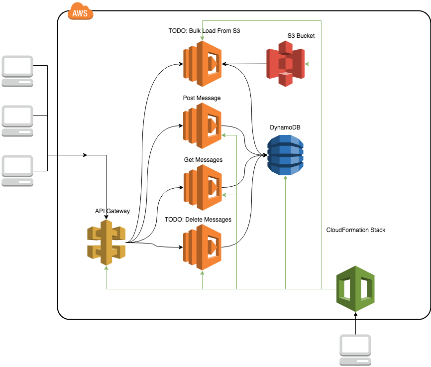

# July2018-LambdaSharp

In this challenge we're going to learn how to use MindTouch's λ# tool to turn simple yaml markup in to a CloudFormation stack and quickly itterate on a stack of functionality provided by a number of Lambda functions and API Gateway

The architecture should look like this:


## Pre-requisites

The following tools and accounts are required to complete these instructions.

- [Complete Step 1 of the AWS Lambda Getting Started Guide](http://docs.aws.amazon.com/lambda/latest/dg/setup.html)
  - Setup an AWS account
  - [Setup the AWS CLI](https://docs.aws.amazon.com/lambda/latest/dg/setup-awscli.html)
- .NET Core 2+ is required
  - <https://www.microsoft.com/net/learn/get-started>

## Level 0 - Setup λ#
- Ensure you have your AWS credentials file set up in the .aws folder under your home directory
- Clone λ# repository <[GitHub - bjorg/LambdaSharpTool at WIP-RC1](https://github.com/bjorg/LambdaSharpTool/tree/WIP-RC1)>
- Clone Messages repository <https://github.com/LambdaSharp/July2018-LambdaSharp>
- Setup command alias for the LambdaSharp tool
  - `$LAMBDASHARP=/path/to/LambdaSharpRepo`
  - `alias lst="dotnet run -p $LAMBDASHARP/src/MindTouch.LambdaSharp.Tool/MindTouch.LambdaSharp.Tool.csproj --"`
- Bootstrap deployment
  - This step provides some necessary infrastructure to your AWS account.
  - `lst deploy --bootstrap --deployment {DeploymentName} --input /path/to/LambdaSharpRepo/BootStrap/LambdaSharp/Deploy.yml`
- Deploy the Messages stack to the same deployment
  - `lst deploy --deployment {DeploymentName} --input /path/to/MessagesAppRepo/BootStrap/LambdaSharp/Deploy.yml`

Now that you have deployed the Messages stack you will have the following infrastructure in your AWS account:
- (DynamoDB Table) MessageTable
  - Stores messages with a unique identifier (_MessageId_) and a source field
- (S3 Bucket) IngestionBucket
  - A bucket to drop text files in to to be loaded into _MessageTable_. Sends event notifications to _LoadMessages_
- (Lambda Function) PostMessages
  - Recieves a message from API Gateway and writes the body as a message to _MessageTable_
- (Lambda Function) GetMessages
  - Reads from _MessageTable_ and returns list of all messages available
- (Lambda Function) LoadMessages
  - Reads from _MessageTable_ and returns list of all messages available. This function is not complete and is to be completed by the user.
- (API Gateway Endpoint) POST:/
  - Sends payload to _PostMessages_ Lambda function
- (API Gateway Endpoint) GET:/
  - Sends payload to _GetMessages_ Lambda function
- (IAM Role)
  - All necessary permissioning is granted

## Level 1 - Implement Bulk Load Lambda Function

The S3 bucket that we created sends CreateObject notifications to the LoadMessages Lambda function. This function, however, does not do anything with the message. The challenge here is to complete the Lambda function code so that it will read the contents of the text file that was uploaded and consider each line a message that should be written into the DynamoDB table.

NOTES: 
- The "source" field should be "S3" here.
- To simplify things, all needed DynamoDB functionallity has been abstracted in the Messages.Tables library so you will not need to interact with it directly.
- Be cautious of the fact that the DynamoDB calls are asyncronous and must be completed before the Lambda function returns.

## Level 2 - Add DeleteMessages Lambda Function

The next piece of functionality we would like to add is the ability to clear out all messages from the DynamoDB table. Add a new entry under the `Functions` section of Deploy.yml for _DeleteMessages_. A new C# project similar to those that exist for the other Lambda functions will need to be added. The λ# tool uses naming conventions to find the corresponding project for function entries in the deploy file so it is important to follow that convention here. The naming convention is `{StackName}.{FunctionName}` so our new project should be called `Messages.DeleteMessages` and the name of the function in the Deploy file should be `DeleteMessages`. The csproj file must exist under a folder of the same name.

NOTES:
- Be sure to add the MindTouch.LambdaSharp NuGet package to your new project

## Level 3 - Add Another Source For Messages

We can now add messages to the DynamoDB table via API Gateway and S3. Choose another source (SNS, SQS, etc) to populate messages and add another lambda function to do so. Examples of sources can be found in the LamdbaSharp repo

## Boss Challenge


Create a new stack (new Deploy.yml file and corresponding csprojs) that will interact with the DynamoDB table. Adding the key `Export` with a value of `/{{Deployment}}/dynamo` will populate the value of the DynamoDB table's name in that location within parameter store. In your new deploy file add the following section under `Parameters`:

```
  - Name: MessageTable
    Description: Imported DynamoDb table for storing received messages
    Import: /{{Deployment}}/dynamo
    Resource:
      Type: AWS::DynamoDB::Table
      Allow: Read
```

With this section you will have read access to the DynamoDB talbe from the Messages stack and you will be able to access the name of the table within the Lambda function with the line `var tableName = config.ReadText("MessageTable");` in the `InitializeAsync` method.

NOTES:
- The Name value in the root of the Deploy file must be different than any other stack you have defined (in this case, Messages).